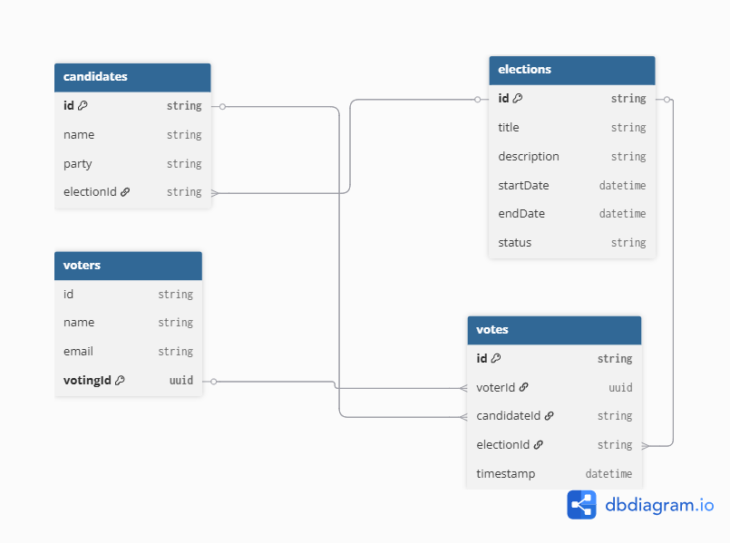

# 🗳️ ElectionApp

A RESTful backend application for managing elections, built with **Java 25**, **Spring Boot**, and **MongoDB**.

---

## 📋 Table of Contents

- [Overview](#overview)
- [Tech Stack](#tech-stack)
- [Database Design](#database-design)
  - [ERD Diagram](#erd-diagram)
  - [Model Relationships](#model-relationships)
- [Prerequisites](#prerequisites)
- [Getting Started](#getting-started)
    - [1. Clone the Repository](#1-clone-the-repository)
    - [2. Start the Database](#2-start-the-database)
    - [3. Configure the Application](#3-configure-the-application)
    - [4. Build and Run](#4-build-and-run)
- [Running Tests](#running-tests)
- [Docker](#docker)

---

## Overview

ElectionApp is a backend application designed to support election management workflows. It exposes a RESTful API built on Spring Boot and persists election data using MongoDB. The application is containerization-ready with a Docker Compose setup for the database.

---

## Tech Stack

| Layer        | Technology                        |
|--------------|-----------------------------------|
| Language     | Java 25                           |
| Framework    | Spring Boot 4.1.0                 |
| Database     | MongoDB (via Spring Data MongoDB) |
| Build Tool   | Apache Maven                      |
| Utilities    | Lombok                            |
| Testing      | Spring Boot Test, Spring MVC Test |
| Container    | Docker / Docker Compose           |

## Database Design

### ERD Diagram


### Model Relationships

- Election → Candidates (One-to-Many)
- Election → Votes (One-to-Many)
- Candidate → Votes (One-to-Many)
- Voter → Votes (One-to-Many)


## Prerequisites

Make sure you have the following installed:

- [Java 21+](https://www.oracle.com/africa/java/technologies/downloads/)
- [Apache Maven 3.8+](https://maven.apache.org/)
- [Docker](https://www.docker.com/) & [Docker Compose](https://docs.docker.com/compose/)

---

## Getting Started

### 1. Clone the Repository

```bash
git clone https://github.com/Dave-n-tech/dreamdevs_electionApp.git
cd dreamdevs_electionApp
```

### 2. Start the Database

Use Docker Compose to spin up a MongoDB instance:

```bash
docker-compose up -d
```

This starts a MongoDB container (`election-db`) on port **27017** with a persistent volume (`mongo-data`).

### 3. Configure the Application

Open `src/main/resources/application.properties` and ensure the MongoDB URI is set:

```properties
spring.data.mongodb.uri=mongodb://localhost:27017/election-db
spring.data.mongodb.database=election-db
server.port=8080
```

### 4. Build and Run

```bash
mvn clean install
mvn spring-boot:run
```

The application will start at `http://localhost:8080`.

---

## Running Tests

```bash
mvn test
```

The test suite uses `spring-boot-starter-test` and `spring-boot-starter-webmvc-test` for unit and integration testing.

---

## Docker

The `docker-compose.yml` defines a single service for the MongoDB database:

```yaml
version: '3.8'
services:
  mongo:
    image: mongo:latest
    container_name: election-db
    ports:
      - "27017:27017"
    volumes:
      - mongo-data:/data/db

volumes:
  mongo-data:
```

**Useful commands:**

```bash
# Start the DB container
docker-compose up -d

# Stop the DB container
docker-compose down

# Stop and remove volumes
docker-compose down -v
```

---

> Built by [David](https://github.com/Dave-n-tech)